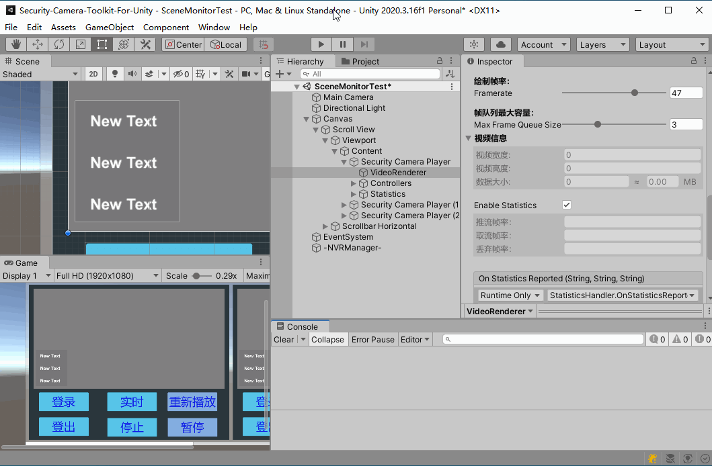
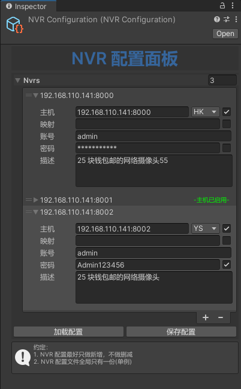
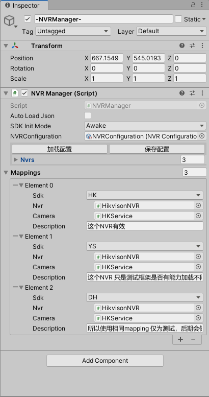
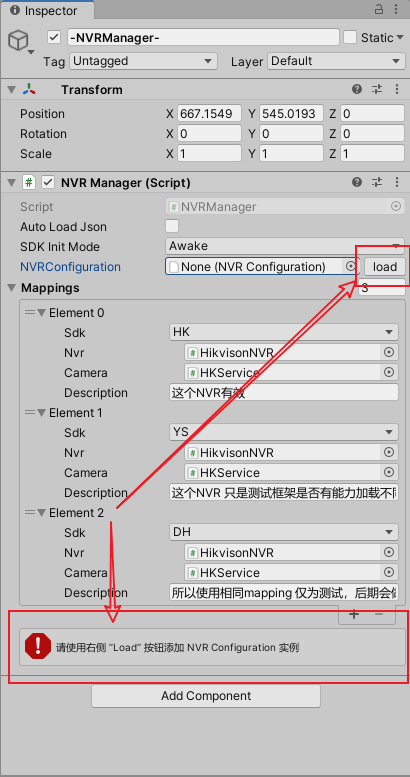
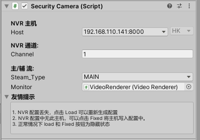
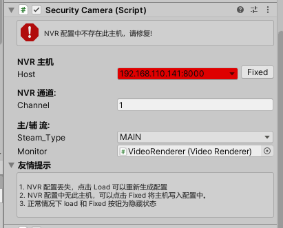
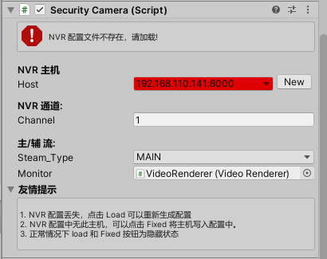
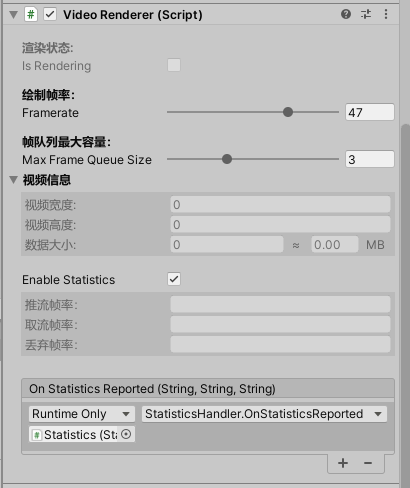

# Security-Camera-Toolkit-For-Unity

> 一个在 Unity 开发的应用中实现国内头部监控厂商监控播放的框架；
> 
> 可扩展，能轻松接入国内所有头部监控厂商的监控 SDK 
> 
> 请注意，此框架仅演示了海康的实时播放功能，但是，因为其他功能都围绕播放来的，所以在本框架 **一** 就是 **多**
> 
> 欢迎各位同仁通过推送 PR 的方式丰富本项目功能，比如 其他厂商SDK的接入， PTZ ，回放，查询，事件的接入等等...

## 动画演示

# 核心组件：

> 核心组件用于约定 NVR 监控框架的内部逻辑、依赖关系。具有完善的编辑器工作流。扩展其他厂商的 SDK 无需修改核心组件。

- ``NVRManager``：用于管理 NVR 登录、登出、SDK的初始化、Clean UP

- ``NVR`` ：所有 NVR 的基类

- ``NVRConfiguration``：用于存储项目中需要加载的 NVR 配置

- ``SecurityCamera`` : 所有厂商的监控的统一门面，用于配置 NVR 主机、通道 

- ``CameraService`` ：所有监控的基类，约定监控公共逻辑

- ``VideoRenderer``:视频渲染组件，用于将 YUV 视频数据转为 RGB 视频帧

## 定制组件：

> 目前仅针对 海康 （Hikvision）实时播放做了定制，使用 async/await 语法糖实现了SDK 的异步登录登出操作，绝不会出现卡 Unity 的现象。
> 
> 如果想要定制其他监控厂商的 SDK ，可以以本人实现的 Hikvision 实时播放功能脚本为蓝本进行临摹（仅 2 个脚本）

- ``HikvisionNVR`` ：实现通过海康 SDK 进行 NVR 的登录、登出、SDK 初始化和回收。

- ``HKService``: 继承 CameraService，实现通过海康 SDK 进行实时视频的低延迟播放。

## 编辑器工作流：
**Tips: 展开小三角可见图文详情**

1. 通过 NVR 配置面板配置你的 NVR 信息

 > 用于记录 NVR 配置信息，实现按配置启用 NVR，支持多个 NVR 同时工作 ，支持公网映射（反向代理需关注 554 端口），支持配置数据序列化、反序列化，本地加载不惧 NVR 变动。
 
 > 使用 ScriptableObject 单例，使用时自动生成，用户无需关注其生命周期；数据本地化 json 保存，一键数据恢复

 

2. 使用 NVR 管理器管理各异的厂商类型的 NVR 

 > 用于加载 NVR配置 并按照 Mappings 设定的类型映射实例化 NVR 和 CameraService ，管理 NVR 的公共行为,管理 SDK 的初始化和回收
 
 > 提供 NVR 配置丢失警示；提供 Mappings ，籍此可以实现多监控厂商 SDK 同时工作在一个项目中。
  
正常|NVR 配置丢失
 |-|-|
 |

3. 使用 Security Camera 管理各异厂商的 CameraService 实例 

 > 作为门面一样的存在，不管是哪一个厂商的监控，都是使用它对外，对内按 NVRManager Mappings 的配置实例化指定的 ``CameraService`` 实现厂商差异化交互逻辑
 
 > 提供了与 NVRConfiguration 联动的 host 下拉选择，无需用户输入；同时提供了与 NVRConfiguration 数据不匹配时的编辑器工作流
  
正常|NVR 配置指定数据丢失|NVR 配置丢失
 |-|-|-|
 ||

4. 通过 Video Renderer 实现个 SDK 推流的渲染

 > 视频渲染组件，实现了 YUV 数据到 RGB 数据的转换；使用 unsafe 数据拷贝，速度更快，按渲染能力拷贝，不做多余的数据对拷操作； 可调整绘制帧率，性能一手掌握；
 
 > 提供帧率统计：推流、渲染、丢弃帧率一目了然，（考虑性能问题，推荐不统计，不展开调试面板）
 
 

## Reference
[我的简书博客](https://www.jianshu.com/p/e8e906c6700c)

## 免责声明：

这个项目目前接的是 海康的 SDK ，如需使用请阅读他们的许可说明，本仓库仅供交流，不对用户任何操作负责。
