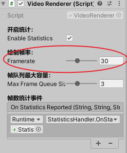

# Security-Camera-Toolkit-For-Unity

 一个在 Unity 中播放国内实时监控的框架 ，A toolkit for play security camera in unity made application

画面不怎么同步，应该是播放库缓存满了，先试试暂时把图中的 绘制帧率

看了下，问题应该是出现在从 ms-webrtc 借鉴来的思路没用好，有时间再慢慢改吧

大体框架已经搭建完成，写了 nvr type 但是还没整合

目前只接了海康 SDK ，也只准备接 海康 SDK ，同时，也只接实时播放，也只准备接实时播放。

但，播放功能实现了，其他功能还有啥要攻克的呢，监控可都围绕播放来的呢？

## 免责声明：

这个项目目前接的是 海康的 SDK ，如需使用请阅读他们的许可说明，本仓库仅供交流，不对用户任何操作负责。
